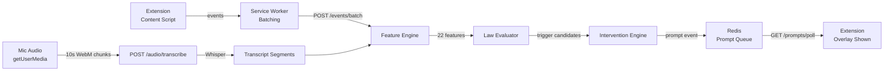

# GleaMeet Architecture

> **Last updated:** 2026-03-23

GleaMeet is a real-time AI meeting coach delivered as a Chrome extension backed by a Node.js API server. It observes meeting signals (speech, captions, behavioral cues), evaluates them against 12 behavioral laws from Cialdini, Kahneman, and Thaler, and delivers personalized nudges via GPT-4o during the call. After the meeting, it generates a detailed coaching report.

---

## Table of Contents

- [Monorepo Structure](#monorepo-structure)
- [Data Pipeline](#data-pipeline)
- [Extension Architecture](#extension-architecture)
- [Backend Architecture](#backend-architecture)
- [Behavioral Laws](#behavioral-laws)
- [LLM Integration](#llm-integration)
- [Audio Capture & Transcription](#audio-capture--transcription)
- [Post-Meeting Reports](#post-meeting-reports)
- [Database Schema](#database-schema)
- [Redis State Management](#redis-state-management)
- [Authentication](#authentication)
- [CORS Policy](#cors-policy)
- [Infrastructure & Deployment](#infrastructure--deployment)
- [Extension Version History](#extension-version-history)

---

## Monorepo Structure

```
gleameet/
├── packages/
│   ├── shared/           # TypeScript types, constants, API contracts
│   ├── law-registry/     # 12 behavioral law definitions (JSON)
│   ├── backend/          # Express.js API server
│   └── extension/        # Chrome extension (Manifest V3)
├── docker-compose.yml    # Local dev: postgres + redis + backend
├── Dockerfile            # Multi-stage production build
├── render.yaml           # Render deployment config
└── scripts/migrate.sh    # DB schema migration
```

**Workspace config:** npm workspaces with build order `shared → law-registry → backend | extension`.

---

## Data Pipeline



### Pipeline Stages

1. **Content Script** — Detects meeting state on `meet.google.com`, captures DOM events (speaker changes, captions, reactions) and mic audio via `getUserMedia`.

2. **Service Worker** — Batches events and forwards them to the backend. Polls `/prompts/poll` on a timer to retrieve pending nudges.

3. **Feature Engine** (`packages/backend/src/services/feature-engine.ts`) — Processes raw events and extracts 22 linguistic/behavioral features. Updates rolling meeting state in Redis. Features include turn count, response latency, acknowledgment count, hedging/certainty language scores, loss/gain framing, action specificity, option counts, and boolean flags for defaults, owners, deadlines, evidence references, and peer examples.

4. **Law Evaluator** (`packages/backend/src/services/law-evaluator.ts`) — Evaluates trigger logic for each active law against the current feature snapshot. Checks disconfirming (suppression) logic. Computes trigger confidence scores.

5. **Intervention Engine** (`packages/backend/src/services/intervention-engine.ts`) — Ranks candidate triggers, selects the best prompt (max 1 per batch), applies rate limiting and cooldowns, then optionally personalizes the nudge text via GPT-4o (non-blocking, 6s timeout with static template fallback).

6. **Prompt Delivery** — Extension polls the backend, retrieves pending prompts from Redis, and renders an overlay on the meeting page.

---

## Extension Architecture

**Manifest V3** Chrome extension targeting Google Meet.

| Component | Source | Role |
|-----------|--------|------|
| **Content Script** | `packages/extension/src/content/content-script.ts` | Meeting detection, DOM event capture, audio capture, prompt overlay rendering |
| **Service Worker** | `packages/extension/src/background/service-worker.ts` | Message routing, session management, event batching, prompt polling |
| **Popup** | `packages/extension/src/popup/Popup.tsx` | Auth UI, coaching status, meeting history, post-meeting reports |
| **API Client** | `packages/extension/src/utils/api-client.ts` | HTTP wrapper for all backend endpoints |

**Permissions:** `activeTab`, `tabCapture`, `storage`, `alarms`, `identity`
**Host permissions:** `https://meet.google.com/*`
**OAuth2 scopes:** `openid`, `email`, `profile`

---

## Backend Architecture

Express.js server on port 3001 with PostgreSQL, Redis, and OpenAI integrations.

### Routes

| Route | Method | Purpose | Auth |
|-------|--------|---------|------|
| `/auth/session` | POST | Google OAuth session creation | No |
| `/meetings/start` | POST | Initialize coaching session | Yes |
| `/meetings/end` | POST | End session, trigger report generation | Yes |
| `/events/batch` | POST | Ingest behavioral events → pipeline | Yes |
| `/prompts/poll` | GET | Fetch pending nudge prompts | Yes |
| `/prompts/ack` | POST | Acknowledge prompt (shown/dismissed/acted) | Yes |
| `/audio/transcribe` | POST | Whisper transcription proxy (multipart) | Yes |
| `/reports/:meeting_session_id` | GET | Retrieve post-meeting report | Yes |
| `/history` | GET | User's meeting history list | Yes |
| `/user` | GET | User profile | Yes |
| `/registry` | GET | Active law registry | Yes |
| `/health` | GET | Service health check | No |
| `/metrics` | GET | Prometheus metrics | No |

**Middleware:** CORS, Helmet, Bearer token auth extraction, request logging.

---

## Behavioral Laws

12 active laws across three source families, defined as JSON in `packages/law-registry/laws/`.

### Cialdini (Persuasion)

| ID | Law | Trigger Summary |
|----|-----|-----------------|
| **C-01** | Reciprocity | No acknowledgments after 3+ turns |
| **C-02** | Commitment & Consistency | 6+ turns with low action specificity |
| **C-03** | Social Proof | No peer examples/evidence after 4+ turns |
| **C-04** | Authority | High certainty without evidence citation |

### Kahneman (Cognitive Bias)

| ID | Law | Trigger Summary |
|----|-----|-----------------|
| **K-01** | System 1 vs System 2 | Rapid rebuttal (<1.5s) after disagreement without clarifying question |
| **K-02** | Loss Aversion | High loss framing (>0.6) without gain framing (<0.3) |
| **K-03** | Anchoring | High specificity + certainty with ≤1 option presented |
| **K-04** | Overconfidence | High certainty (>0.7) without evidence |

### Thaler (Nudge Theory)

| ID | Law | Trigger Summary |
|----|-----|-----------------|
| **T-01** | Choice Architecture | 3+ options without default recommendation |
| **T-02** | Default Effect | Multiple options without default after 5+ turns |
| **T-03** | Nudge | Agreement detected without owner or deadline assignment |
| **T-04** | Present Bias | High loss framing (>0.5) with low gain framing (<0.2) |

Each law definition includes: `trigger_logic` (conditions on features), `disconfirming_logic` (suppression rules), `prompt_templates_live` (real-time nudge text), `prompt_templates_post` (post-meeting reflection), `confidence_threshold`, and `cooldown_seconds`.

**Positive reinforcement:** Every 5 positive behaviors, the system generates a GPT-4o compliment citing the specific good behavior observed.

---

## LLM Integration

| Model | Provider | Use Case |
|-------|----------|----------|
| **GPT-4o** | OpenAI | Nudge personalization, positive reinforcement, report narrative generation |
| **Whisper-1** | OpenAI | Audio transcription (mic capture) |
| **Ollama (llama3.2)** | Local fallback | Development/offline mode |

**Nudge personalization:** Recent transcript (last 5 segments) + feature snapshot → JSON output with `short_text` (≤25 words) and `rationale_text` (≤20 words). Temperature 0.7, 6-second timeout with static template fallback.

**Config:** `LLM_API_KEY`, `LLM_BASE_URL`, `LLM_MODEL` environment variables. Defaults to local Ollama for development.

---

## Audio Capture & Transcription

1. **Content script** calls `navigator.mediaDevices.getUserMedia({ audio: true })` to capture the user's microphone.
2. Audio is recorded in 10-second WebM chunks via `MediaRecorder`.
3. Each chunk is `POST`ed to `/audio/transcribe` as multipart form data (≤25 MB).
4. Backend proxies to OpenAI Whisper-1 and returns transcribed text with stream type (mic/tab).
5. Transcript segments are fed into the Feature Engine for linguistic analysis.

**Fallback:** DOM caption observer scrapes Google Meet's live captions as a lower-confidence signal source.

---

## Post-Meeting Reports

Generated when `/meetings/end` is called. Stored in `post_meeting_reports`.

| Field | Description |
|-------|-------------|
| `summary_analysis` | GPT-4o narrative summary of meeting coaching dynamics |
| `transcript_with_nudges` | Full transcript annotated with nudge events inline |
| `strengths` | Positive behavioral patterns identified |
| `growth_areas` | Areas for improvement with specific examples |
| `recommended_actions` | Actionable next steps with reasons tied to law triggers |
| `timeline` | Chronological sequence of key events and nudges |

---

## Database Schema

PostgreSQL 16. Schema at `packages/backend/src/db/schema.sql`.

| Table | Purpose |
|-------|---------|
| `users` | Google OAuth accounts (UUID PK, google_subject_id, email, preferences JSONB) |
| `meeting_sessions` | Meeting lifecycle (user FK, platform, start/end times, status, extension version) |
| `consent_records` | Privacy consent tracking (per-meeting, revocable, scope JSONB) |
| `raw_events` | All captured events (event_type, source, capture_confidence, payload JSONB) |
| `feature_observations` | Computed features per window (30s, 90s, full_meeting) |
| `law_registry_entries` | Versioned law definitions (status: draft/active/deprecated/disabled) |
| `law_triggers` | Triggered laws with confidence and evidence refs |
| `prompt_events` | Nudge delivery tracking (display_state, shown_at, dismissed_at) |
| `post_meeting_reports` | Report JSON blobs (summary, insights, strengths, growth areas, timeline) |
| `meeting_transcripts` | Aggregated transcript JSON per session |
| `deletion_audits` | GDPR deletion audit log (scope: meeting or all_user_data) |

**Cascade:** Deleting a user cascades through all related meeting data.

---

## Redis State Management

Redis 7. Key patterns prefixed with `gleameet:`.

| Key Pattern | Purpose | TTL |
|-------------|---------|-----|
| `gleameet:meeting:<sessionId>:state` | Rolling MeetingState (features, transcript buffer, counters) | 4h |
| `gleameet:meeting:<sessionId>:cooldown:<lawId>` | Per-law cooldown | 30–60s |
| `gleameet:meeting:<sessionId>:global_cooldown` | Global prompt cooldown | 15–60s |
| `gleameet:meeting:<sessionId>:prompt_count` | Rate limit counter | 30min |
| `gleameet:meeting:<sessionId>:speaking` | User speaking state | 4h |
| `gleameet:session:<token>` | Auth session validation | 24h |

**MeetingState** includes: timing metrics, turn counts, linguistic accumulator counters (hedging, certainty, loss/gain framing), structural boolean flags, a rolling transcript buffer (last 10 segments), and prompt tracking arrays.

---

## Authentication

```
Chrome Extension                          Backend
     │                                       │
     │  chrome.identity.getAuthToken()        │
     │  → Google OAuth access token           │
     │                                       │
     │  POST /auth/session {token}  ────────► │
     │                                       │  GET googleapis.com/oauth2/v3/userinfo
     │                                       │  → sub, email, name
     │                                       │  upsertUser()
     │                                       │  Generate session:userId:uuid
     │                                       │  Store in Redis (24h TTL)
     │  ◄──── { session_token, user_id }      │
     │                                       │
     │  All subsequent requests:              │
     │  Authorization: Bearer session:...     │
```

**Scopes:** `openid`, `email`, `profile`
**Session format:** `session:<userId>:<uuid>`

---

## CORS Policy

Configured in `packages/backend/src/index.ts`.

| Origin | Purpose |
|--------|---------|
| `chrome-extension://*` | Extension requests |
| `http://localhost*` | Local development |
| `https://meet.google.com` | Content script on Meet pages |
| `https://teams.microsoft.com` | Future: Teams support |
| `https://app.zoom.us` | Future: Zoom support |

Credentials enabled for all allowed origins.

---

## Infrastructure & Deployment

| Component | Technology | Location |
|-----------|------------|----------|
| **Backend** | Node.js 20 + Express | Render (Virginia) |
| **Database** | PostgreSQL 16 | Render managed |
| **Cache** | Redis 7 | Render managed |
| **Extension** | Chrome Web Store | Client-side |
| **Container** | Docker multi-stage (Node 20-alpine) | Production builds |

**Local development:** `docker-compose.yml` runs PostgreSQL + Redis. Backend runs via `npm run dev:backend`. Extension built with esbuild via `npm run dev:extension`.

**Production build:** Multi-stage Dockerfile — builder stage installs deps and compiles TypeScript, production stage copies only built artifacts and production dependencies.

**Deployment:** Render auto-deploys from `main`. `render.yaml` defines the web service with build command `npm install && npm run build:shared && npm run build:law-registry && npm run build:backend && bash scripts/migrate.sh`.

---

## Extension Version History

| Version | Date | Changes |
|---------|------|---------|
| v1.0.0 | 2026-03-21 | Initial release: real-time coaching, 12 behavioral laws, DOM caption scraping, post-meeting reports |
| v1.0.1 | 2026-03-21 | Real Google OAuth, privacy policy page, Web Store preparation |
| v1.0.2 | 2026-03-21 | Brand icons from gleameet-logo.webp, stable extension key |
| v1.0.3 | 2026-03-21 | Silent auth on popup open, sign-in button as fallback |
| v1.0.4 | 2026-03-21 | Cloud deployment support, extension points to gleameet.onrender.com |
| v1.0.5 | 2026-03-22 | Richer recommendations with rationale, transcript saving |
| v1.0.6 | 2026-03-22 | Personalized live nudges via GPT-4o with transcript context (≤25 words) |
| v1.0.7 | 2026-03-22 | Nudges include specific why-rationale citing observed behavior |
| v1.0.8 | 2026-03-22 | Positive reinforcement: GPT-4o compliments every 5 positive signals |
| v1.0.9 | 2026-03-22 | Post-call report with annotated transcript + GPT-4o narrative summary |
| v1.0.10 | 2026-03-22 | Report view in popup with summary analysis |
| v1.0.11 | 2026-03-23 | Audio capture via getUserMedia in content script, Whisper transcription replacing caption scraping |
| v1.0.12 | 2026-03-23 | Nudge rate limit raised (20→60), fatigue penalty reduction, meet.google.com CORS fix |
